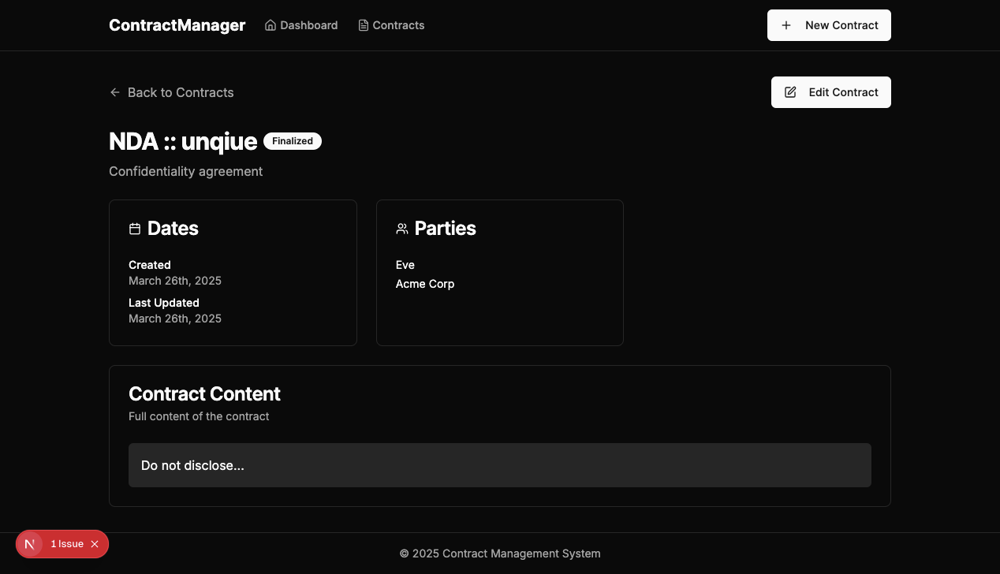
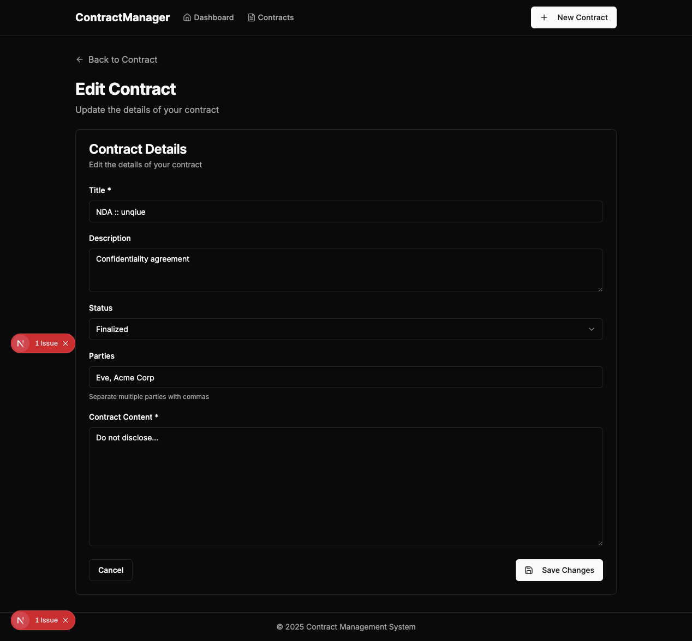
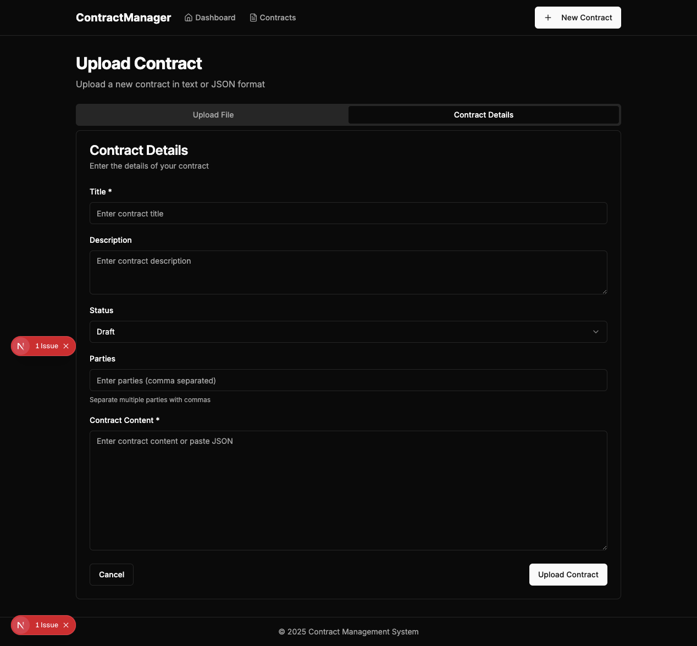
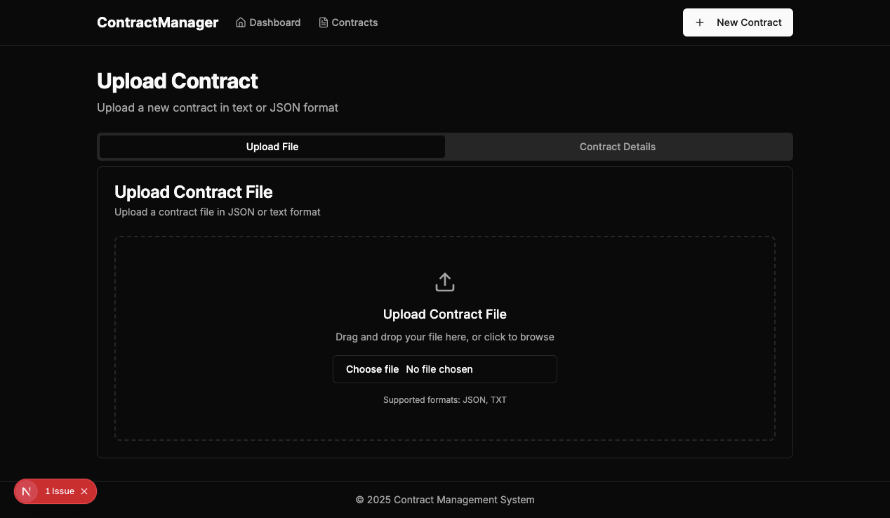

# 📝 Mini Contract UI

A minimal and powerful interface to manage contracts with **real-time updates**, filtering, search, and pagination.

[👉 View the Backend Repo](https://github.com/adityapandey9/mini-contract-api)  
[👉 View the Frontend Repo](https://github.com/adityapandey9/mini-contarct-ui.git)

---

## 🚀 Features

### ✅ Upload Contracts
- Supports uploading **contract data** in `.txt` or `.json` format.
- Handles title, status (Draft/Finalized), parties, and content.

### ✅ View & Search Contracts
- Browse all uploaded contracts in a responsive table.
- **Search by:**
  - Contract title
  - Client name
  - Contract ID

### ✅ Filtering & Pagination
- Filter contracts by **status**: `Draft`, `Finalized`
- Paginate through contract results efficiently

### ✅ Edit Contract Details
- View and edit a contract's metadata
- Save changes in-place

### ✅ Real-Time Updates
- Contracts update in real time using **WebSocket**
- If another user finalizes a contract, the UI reflects it live!

---

## 📸 Screenshots

### 🏠 Dashboard


### 📋 Contracts List


### 🔍 View a Contract


### ✏️ Edit a Contract


### 📤 Upload Contract (Step 1)


### 📤 Upload Contract (Step 2)


---

## 🛠 Tech Stack

- ⚛️ React + TypeScript
- 🧠 Zustand for state management
- 🌐 WebSocket for real-time sync
- 🧾 REST API integration for contract management

---

## 🔗 Getting Started

```bash
# Clone the repository
git clone https://github.com/adityapandey9/mini-contarct-ui.git

# Navigate into project folder
cd mini-contarct-ui

# Install dependencies
npm install

# Run the development server
npm run dev
```

---

## 📦 Folder Structure

```
mini-contract-ui/
├── components/
├── hooks/
├── pages/
├── services/
├── store/
├── types/
└── images/
```

---

## 📬 Contributing

Pull requests are welcome. For major changes, please open an issue first to discuss what you would like to change.

---

## 📄 License

MIT © [Aditya Pandey](https://github.com/adityapandey9)
